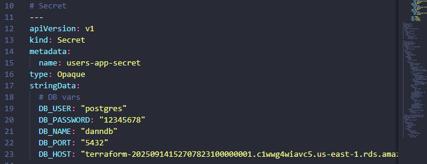

# Cloud-native application — Group 1

Master's course project for **MISW4301 — Cloud Application Development** (Universidad de los Andes). A set of Python microservices deployed on Kubernetes, with Terraform-managed infrastructure on AWS.

## Table of contents

- [Project structure](#project-structure)
- [Configuration file](#configuration-file)
- [Per-application structure](#per-application-structure)
- [Deploy the full application (delivery 3)](#deploy-the-full-application-delivery-3)
- [Deploy the full application](#deploy-the-full-application)
  - [Prerequisites](#prerequisites)
  - [1. Create infrastructure](#1-create-infrastructure)
  - [2. Configure the database](#2-configure-the-database)
  - [3. Build and push images](#3-build-and-push-images)
  - [4. Apply deployments](#4-apply-deployments)

## Project structure

```
.
├── github/
│   └── workflows/          # Repository pipelines
├── docs/                   # Technical documentation
├── k8s/                    # Kubernetes deployment manifests
├── k8s_entrega_3/          # Kubernetes manifests for delivery 3
├── offers_app              # Offers service
├── posts_app               # Posts service
├── routes_app              # Routes service
├── users_app               # Users service
├── scores_app              # Scores service
├── rf003                   # Service for requirement RF003
├── rf004                   # Service for requirement RF004
├── rf005                   # Service for requirement RF005
├── consumer                # Consumer
├── notifications_app       # Email notifications service
├── credit_cards            # Credit cards service
├── vale.ini                # Vale configuration
├── config.yaml             # Repository configuration
├── Makefile                # Evaluation scripts
└── README.md
```

1. **github/workflows**: CI files used to validate the project.
   * `ci_evaluador_entrega3.yml` checks Kubernetes configuration and runs tests for each application.
   * `ci_evaluador_unit.yml` runs unit tests.
2. **k8s**: application configuration and deployment files.
3. **docs**: technical documentation.
4. **&lt;application&gt;**: one folder per application (offers, posts, routes, users, scores, rf003, rf004, rf005, credit_cards, notifications_app, consumer).
5. **makefile**: used by the evaluation pipelines; includes utility scripts to build project infrastructure.

## Configuration file

`config.yaml` holds the configuration used by the pipelines to evaluate the delivery.

## Per-application structure

For each application, use its own documentation to deploy it:

1. [offers](https://github.com/MISW-4301-Desarrollo-Apps-en-la-Nube/s202514-proyecto-grupo1/tree/main/offers_app)
2. [posts](https://github.com/MISW-4301-Desarrollo-Apps-en-la-Nube/s202514-proyecto-grupo1/tree/main/posts_app)
3. [routes](https://github.com/MISW-4301-Desarrollo-Apps-en-la-Nube/s202514-proyecto-grupo1/tree/main/routes_app)
4. [users](https://github.com/MISW-4301-Desarrollo-Apps-en-la-Nube/s202514-proyecto-grupo1/tree/main/users_app)
5. [scores](https://github.com/MISW-4301-Desarrollo-Apps-en-la-Nube/s202514-proyecto-grupo1/tree/main/scores_app)
6. [rf003](https://github.com/MISW-4301-Desarrollo-Apps-en-la-Nube/s202514-proyecto-grupo1/tree/main/rf003)
7. [rf004](https://github.com/MISW-4301-Desarrollo-Apps-en-la-Nube/s202514-proyecto-grupo1/tree/main/rf004)
8. [rf005](https://github.com/MISW-4301-Desarrollo-Apps-en-la-Nube/s202514-proyecto-grupo1/tree/main/rf005)
9. [consumer](https://github.com/MISW-4301-Desarrollo-Apps-en-la-Nube/s202514-proyecto-grupo1/tree/main/consumer)
10. [notifications](https://github.com/MISW-4301-Desarrollo-Apps-en-la-Nube/s202514-proyecto-grupo1/tree/main/notifications_app)
11. [credit_cards](https://github.com/MISW-4301-Desarrollo-Apps-en-la-Nube/s202514-proyecto-grupo1/tree/main/credit_cards)

## Deploy the full application (delivery 3)

To deploy the application, run `scripts/build_entrega_3.sh` or `scripts/build_entrega_3_with_input.sh`. The latter reads the variables declared in `scripts/define_inputs.sh` to make the command easier to run.

For `APP_VERSION`, use the tag `3.0.0`.

This script builds all stacks, images, and Kubernetes resources. Midway through you will see a prompt to update the database URL. Do that in these files:

- [k8s_entrega_3/credit-cards-deployment.yaml](./k8s_entrega_3/credit-cards-deployment.yaml)
- [k8s_entrega_3/users-app-deployment.yaml](./k8s_entrega_3/users-app-deployment.yaml)

When the process finishes, point the Lambda at the load balancer:

1. Open AWS Lambda
2. Select `consumer-application`
3. Go to Configuration > Environment variables
4. Update the URLs so they point at the load balancer. Do this for every URL, e.g. `http://a7a285d596d9945e8be36f438457d3af-1676330551.us-east-1.elb.amazonaws.com/...`

## Deploy the full application

### Prerequisites

- terraform
- kubectl
- docker
- aws CLI
- helm
- make

### 1. Create infrastructure

```
bash scripts/build_stacks.sh
```

### 2. Configure the database

Update the following files:

- `k8s/offers-app-deployment`
- `k8s/posts-app-deployment`
- `k8s/routes-app-deployment`
- `k8s/scores-app-deployment`
- `k8s/users-app-deployment`

Change the database host secret in each of them:



### 3. Build and push images

```
bash scripts/build_images.sh
```

### 4. Apply deployments

```bash
bash scripts/build_k8s.sh
```

Ingress configuration may fail at this step. If you get an ingress-related error, run:

```bash
kubectl apply -f ./k8s
```
