# Grupo
Nombre: Alfa buena maravilla onda dinamita escuadrón lobo

Líder: Andrés Donoso

## Tabla de contenido

- [Grupo](#grupo)
  - [Tabla de contenido](#tabla-de-contenido)
- [Integrantes](#integrantes)
- [Reglas](#reglas)
  - [Vistas de arquitectura](#vistas-de-arquitectura)
    - [Vista de información](#vista-de-información)
    - [Vista funcional](#vista-funcional)
    - [Vista de despliegue](#vista-de-despliegue)
    - [Vista de red](#vista-de-red)
    - [Vista de desarrollo](#vista-de-desarrollo)
      - [Tecnologías](#tecnologías)
  - [Requerimientos](#requerimientos)
    - [Requerimiento RF-003](#requerimiento-rf-003)
    - [Requerimiento RF-004](#requerimiento-rf-004)
    - [Requerimiento RF-005](#requerimiento-rf-005)
    - [Requerimiento RF-006](#requerimiento-rf-006)
    - [Requerimiento RF-007](#requerimiento-rf-007)

# Integrantes
<table>
  <tr>
    <th>Nombre</th>
    <th>Correo</th>
    <th>Usuario GitHub</th>
    <th>Rol</th>
    <th>Interés</th>
  </tr>
  <tr>
    <td>Andrés Donoso</td>
    <td>af.donoso@uniandes.edu.co</td>
    <td>afDonosoD</td>
    <td>Backend</td>
    <td>Desarrollo</td>
  </tr>
  <tr>
    <td>Germán Martínez</td>
    <td>gd.martinez@uniandes.edu.co</td>
    <td>DavidMS73</td>
    <td>Backend</td>
    <td>Desarrollo</td>
  </tr>
  <tr>
    <td>Nicolas Cárdenas</td>
    <td>ne.cardenas@uniandes.edu.co</td>
    <td>EstebanCardenas</td>
    <td>Backend</td>
    <td>Desarrollo</td>
  </tr>
  <tr>
    <td>Daniel Corzo</td>
    <td>d.corzos@uniandes.edu.co</td>
    <td>daniel-corzo</td>
    <td>Backend</td>
    <td>Desarrollo</td>
  </tr>
</table>

# Reglas
1. Entrar a las reuniones programadas a tiempo (máximo 5 minutos tarde). 
2. Realizar al menos 2 reuniones semanales, una para planear la semana y otra para revisar lo que se completó en la semana. 
3. Revisar siempre el trabajo hecho por el otro integrante del equipo y dar retroalimentación para que complete lo realizado o se den felicitaciones por el trabajo hecho. 
4. En todos los trabajos grupales el equipo se compromete a aspirar a una nota de 5. 
5. Se definen las siguientes herramientas de colaboración adicionales: Google Docs para edición de documentos, Slack/WhatsApp para preguntas, Zoom para reuniones, Slides para edición de diapositivas. 
6. Comunicar a tiempo algún contratiempo que no permita subirse a las reuniones o cumplir a tiempo una actividad, con el fin de que el equipo brinde el soporte en caso de ser necesario. 

## Vistas de arquitectura

### Vista de información

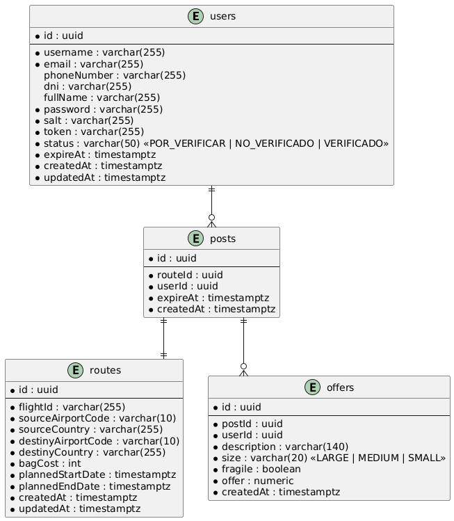

### Vista funcional
  
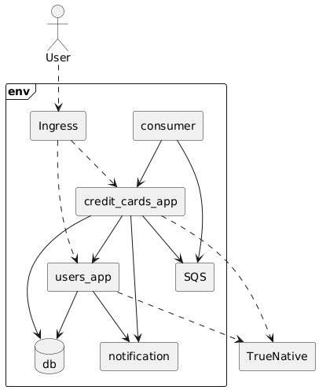

<table>
  <tr>
    <th>Componente</th>
    <th>rf003</th>
  </tr>
  <tr>
    <td>Código/Id del componente</td>
    <td>rf003</td>
  </tr>
  <tr>
    <td>Tipo</td>
    <td>Servicio</td>
  </tr>
  <tr>
    <td>Responsabilidad</td>
    <td>Gestionar el requerimiento rf003 e implementar el patrón Saga</td>
  </tr>
  <tr>
    <td>Consideraciones de diseño</td>  
    <td>
      El componente rf003 funciona como orquestador de la transacción entera. Con Saga se gana resiliencia pero se introduce complejidad adicional. Al ser un orquestador central, puede convertirse en un punto único de fallo y un cuello de botella.
    </td>
  </tr>
  <tr>
    <td>Integraciones</td>
    <td>Comunicación síncrona con los microservicios de publicaciones, trayectos y usuarios a través de HTTP.</td>
  </tr>
</table>

<table>
  <tr>
    <th>Componente</th>
    <th>rf004</th>
  </tr>
  <tr>
    <td>Código/Id del componente</td>
    <td>rf004</td>
  </tr>
  <tr>
    <td>Tipo</td>
    <td>Servicio</td>
  </tr>
  <tr>
    <td>Responsabilidad</td>
    <td>Gestionar el requerimiento rf004 e implementar el patrón Saga</td>
  </tr>
  <tr>
    <td>Consideraciones de diseño</td>  
    <td>
      El componente rf004 funciona como orquestador de la transacción entera. Con Saga se gana resiliencia pero se introduce complejidad adicional. Al ser un orquestador central, puede convertirse en un punto único de fallo y un cuello de botella.
    </td>
  </tr>
  <tr>
    <td>Integraciones</td>
    <td>Comunicación síncrona con los microservicios de publicaciones, trayectos, usuarios, ofertas y utilidades a través de HTTP.</td>
  </tr>
</table>

<table>
  <tr>
    <th>Componente</th>
    <th>rf005</th>
  </tr>
  <tr>
    <td>Código/Id del componente</td>
    <td>rf005</td>
  </tr>
  <tr>
    <td>Tipo</td>
    <td>Servicio</td>
  </tr>
  <tr>
    <td>Responsabilidad</td>
    <td>Gestionar el requerimiento rf005</td>
  </tr>
  <tr>
    <td>Consideraciones de diseño</td>
    <td>
      El componente <strong>rf005</strong> funciona como orquestador de la transacción completa. 
      Al ser un orquestador central, puede convertirse en un punto único de fallo y un cuello de botella.
    </td>
  </tr>
  <tr>
    <td>Integraciones</td>
    <td>Comunicación síncrona con los microservicios de publicaciones, trayectos, usuarios, ofertas y utilidades a través de HTTP.</td>
  </tr>
</table>

<table>
  <tr>
    <th>Componente</th>
    <th>credit-cards</th>
  </tr>
  <tr>
    <td>Código/Id del componente</td>
    <td>credit_cards_app</td>
  </tr>
  <tr>
    <td>Tipo</td>
    <td>Servicio</td>
  </tr>
  <tr>
    <td>Responsabilidad</td>
    <td>Gestionar las tarjetas de crédito de un usuario</td>
  </tr>
  <tr>
    <td>Consideraciones de diseño</td>
    <td>
      El componente <strong>credit-cards</strong> maneja la creación de tarjetas utilizando el servicio TrueNative. 
      Al momento del registro, envía un mensaje a una cola SQS para vigilar el estado de la tarjeta.
    </td>
  </tr>
  <tr>
    <td>Integraciones</td>
    <td>Comunicación síncrona con TrueNative y asíncrona con la función Lambda que hace polling para el estado de la tarjeta.</td>
  </tr>
</table>

<table>
  <tr>
    <th>Componente</th>
    <th>notifications</th>
  </tr>
  <tr>
    <td>Código/Id del componente</td>
    <td>notifications_app</td>
  </tr>
  <tr>
    <td>Tipo</td>
    <td>Servicio</td>
  </tr>
  <tr>
    <td>Responsabilidad</td>
    <td>Gestionar los envíos de correos electrónicos</td>
  </tr>
  <tr>
    <td>Consideraciones de diseño</td>
    <td>
      El componente <strong>notifications</strong> gestiona los envíos de correos electrónicos mediante integración con un proveedor de email marketing.
    </td>
  </tr>
  <tr>
    <td>Integraciones</td>
    <td>Comunicación síncrona con Sendgrid.</td>
  </tr>
</table>

<table>
  <tr>
    <th>Componente</th>
    <th>consumer</th>
  </tr>
  <tr>
    <td>Código/Id del componente</td>
    <td>consumer_lambda</td>
  </tr>
  <tr>
    <td>Tipo</td>
    <td>Lambda</td>
  </tr>
  <tr>
    <td>Responsabilidad</td>
    <td>Consultar periódicamente si la respuesta de TrueNative ya está disponible para la tarjeta.</td>
  </tr>
  <tr>
    <td>Consideraciones de diseño</td>
    <td>
      El componente se ejecuta cuando hay mensajes disponibles en la cola. 
      Se deben considerar tiempos de ejecución, cold start y costo según la frecuencia de invocaciones.
    </td>
  </tr>
  <tr>
    <td>Integraciones</td>
    <td>Recibir mensajes de la cola SQS.</td>
  </tr>
</table>

<table>
  <tr>
    <th>Componente</th>
    <th>SQS</th>
  </tr>
  <tr>
    <td>Código/Id del componente</td>
    <td>sqs_queue</td>
  </tr>
  <tr>
    <td>Tipo</td>
    <td>Cola de mensajes</td>
  </tr>
  <tr>
    <td>Responsabilidad</td>
    <td>Almacenar los mensajes enviados para su posterior procesamiento.</td>
  </tr>
  <tr>
    <td>Consideraciones de diseño</td>
    <td>
      Se deben configurar la visibilidad, la retención y el tiempo de vida de los mensajes 
      para garantizar un procesamiento exitoso.
    </td>
  </tr>
  <tr>
    <td>Integraciones</td>
    <td>Recibir mensajes del servicio de tarjetas de crédito y mantenerlos hasta que la Lambda los procese satisfactoriamente.</td>
  </tr>
</table>

### Vista de despliegue

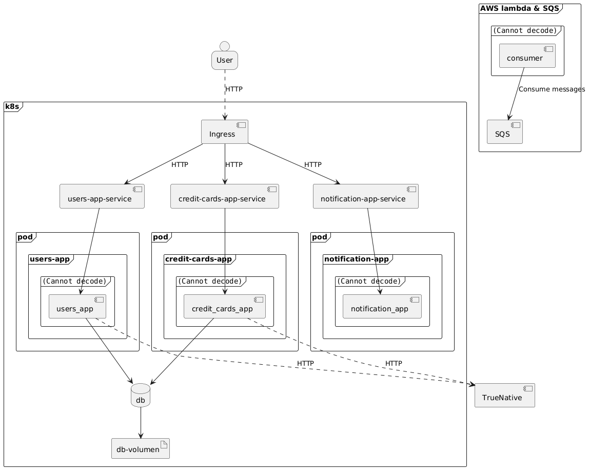

### Vista de red

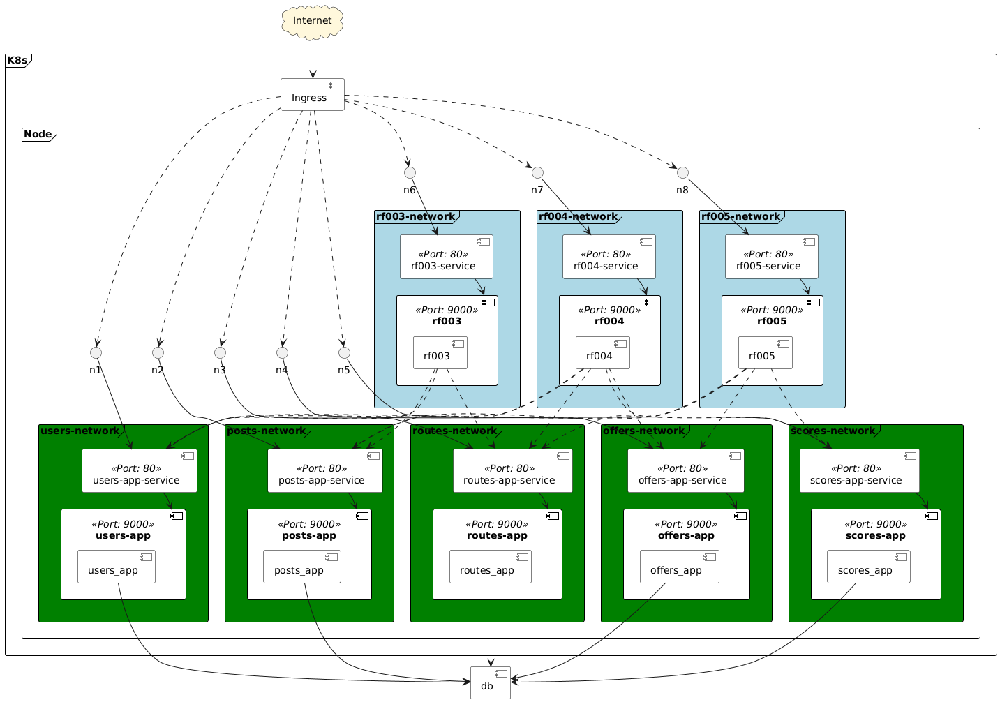

### Vista de desarrollo

#### Tecnologías
1. Lenguajes: Python / Go - Framework: FastAPI / GIN
2. Librerías de pruebas: pytest y httpx
3. Base de datos: PostgreSQL (producción), SQLite (pruebas)
4. ORM: SQLAlchemy / GORM
5. Serialización/validación: Pydantic
6. Servidor ASGI: Uvicorn
7. Manejo de dependencias: poetry
8.  Despliegue: Docker

## Requerimientos

### Requerimiento RF-003

<table>
  <tr>
    <th>Requerimiento</th>
    <th>RF003</th>
  </tr>
  <tr>
    <td>Patrón utilizado</td>
    <td>Saga</td>
  </tr>
  <tr>
    <td>Justificación</td>
    <td>Este patrón permite la implementación de transacciones que involucran varios microservicios. Es necesario aplicar el patrón a este requerimiento ya que se necesita acceder a diferentes microservicios para cumplir con el mismo. Por otra parte, el patrón usa operaciones para revertir las interacciones con cada servicio en caso de que ocurra una falla a fin de mantener la consistencia de los datos.</td>
  </tr>
  <tr>
    <td>Atributos de calidad favorecidos</td>
    <td>
      <ul>
        <li>Consistencia</li>
        <li>Tolerancia a fallos</li>
      </ul>
    </td>
  </tr>
  <tr>
    <td>Atributos de calidad desfavorecidos</td>
    <td>
      <ul>
        <li>Simplicidad</li>
        <li>Depurabilidad</li>
      </ul>
    </td>
  </tr>
  <tr>
    <td>Componentes involucrados</td>
    <td>
      <ul>
        <li>rf003</li>
        <li>Microservicio publicaciones</li>
        <li>Microservicio trayectos</li>
        <li>Microservicio usuarios</li>
      </ul>
    </td>
  </tr>
</table>

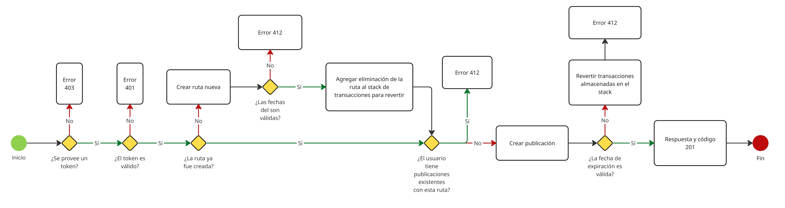
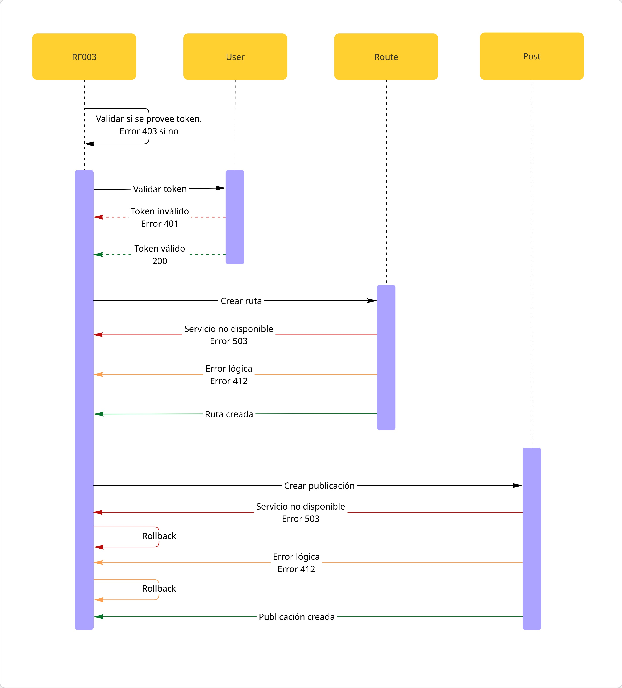

### Requerimiento RF-004

<table>
  <tr>
    <th>Requerimiento</th>
    <th>RF004</th>
  </tr>
  <tr>
    <td>Patrón utilizado</td>
    <td>Saga</td>
  </tr>
  <tr>
    <td>Justificación</td>
    <td>Este patrón permite la implementación de transacciones que involucran varios microservicios. Es necesario aplicar el patrón a este requerimiento ya que se necesita acceder a diferentes microservicios para cumplir con el mismo. Por otra parte, el patrón usa operaciones para revertir las interacciones con cada servicio en caso de que ocurra una falla a fin de mantener la consistencia de los datos.</td>
  </tr>
  <tr>
    <td>Atributos de calidad favorecidos</td>
    <td>
      <ul>
        <li>Consistencia</li>
        <li>Tolerancia a fallos</li>
      </ul>
    </td>
  </tr>
  <tr>
    <td>Atributos de calidad desfavorecidos</td>
    <td>
      <ul>
        <li>Simplicidad</li>
        <li>Depurabilidad</li>
      </ul>
    </td>
  </tr>
  <tr>
    <td>Componentes involucrados</td>
    <td>
      <ul>
        <li>rf004</li>
        <li>Microservicio publicaciones</li>
        <li>Microservicio trayectos</li>
        <li>Microservicio usuarios</li>
        <li>Microservicio utilidades</li>
        <li>Microservicio ofertas</li>
      </ul>
    </td>
  </tr>
</table>

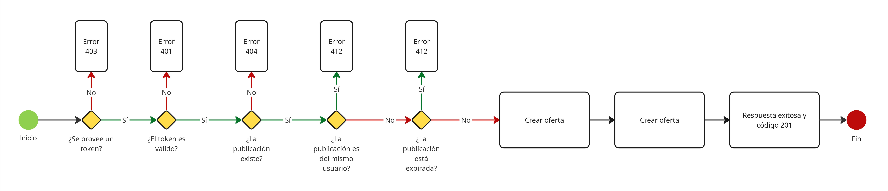
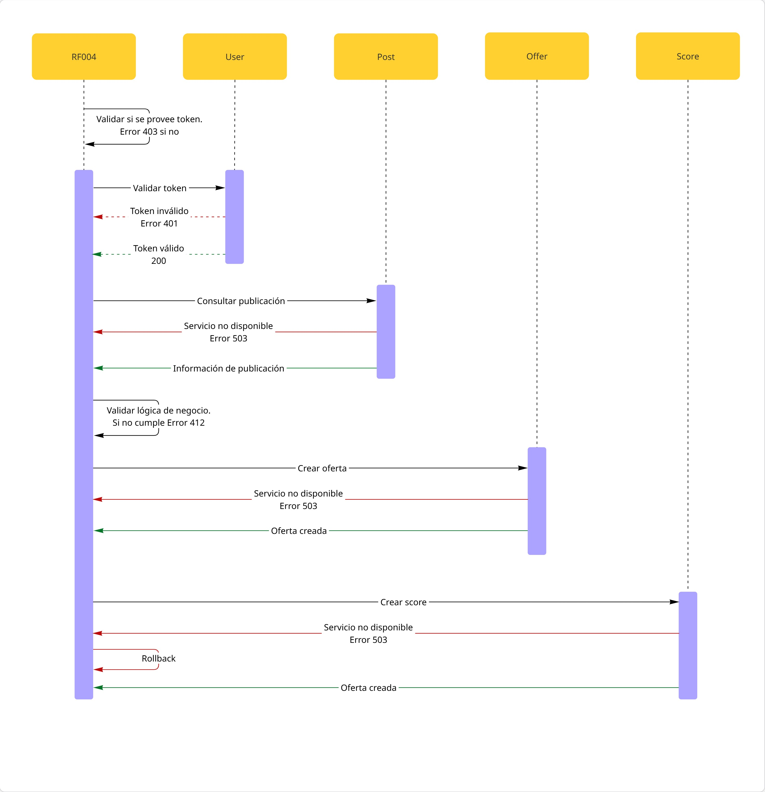

### Requerimiento RF-005

<table>
  <tr>
    <th>Requerimiento</th>
    <th>RF005</th>
  </tr>
  <tr>
    <td>Patrón utilizado</td>
    <td>Agregador</td>
  </tr>
  <tr>
    <td>Justificación</td>
    <td>No es necesario implemementar una Saga ya que no se presenta ninguna operación transaccional, por lo tanto, no es necesario un servicio de compensación. En este requerimiento únicamente se consulta información de otros microservicios. En la solución de este requerimiento se puede ver que el componente se ubica en la mitad, entre el cliente que quiere consumirlo y los microservicios.</td>
  </tr>
  <tr>
    <td>Componentes involucrados</td>
    <td>
      <ul>
        <li>rf005</li>
        <li>Microservicio publicaciones</li>
        <li>Microservicio trayectos</li>
        <li>Microservicio usuarios</li>
        <li>Microservicio utilidades</li>
        <li>Microservicio ofertas</li>
      </ul>
    </td>
  </tr>
</table>

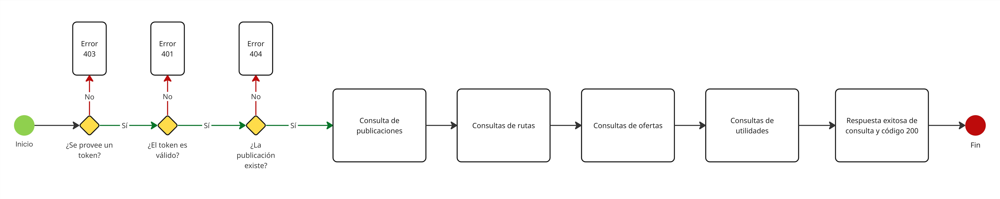
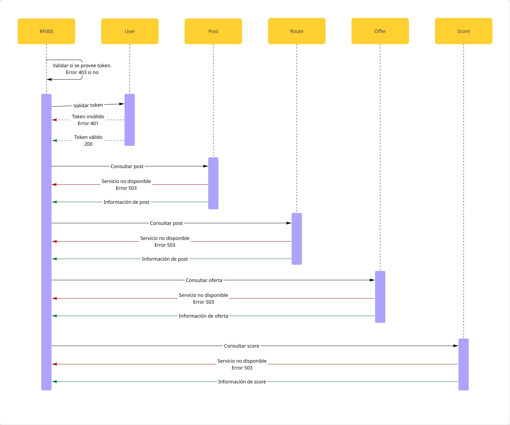

### Requerimiento RF-006

<table>
  <tr>
    <th>Requerimiento</th>
    <th>RF006</th>
  </tr>
  <tr>
    <td>Patrón utilizado</td>
    <td>Productor-consumidor y Polling Pattern</td>
  </tr>
  <tr>
    <td>Justificación</td>
    <td>Con el patrón productor-consumidor se hace entrega de eventos a un solo consumidor por medio de colas FIFO. Los eventos son almacenados en la cola hasta que puedan ser procesados, en caso de que la respuesta del servicio de tarjetas aún no esté disponible se lanzará un error interno que generará que se vuelva a procesar el mensaje por el consumidor hasta que sea procesado satisfactoriamente. Este procesamiento del consumidor es Polling Pattern, ya que se consulta periódicamente si la respuesta del servicio ya está completada para realizar la actualización respectiva y envío de correo.</td>
  </tr>
  <tr>
    <td>Componentes involucrados</td>
    <td>
      <ul>
        <li>Microservicio usuarios</li>
        <li>Microservicio tarjetas</li>
        <li>Consumidor</li>
        <li>SQS</li>
        <li>TrueNative</li>
      </ul>
    </td>
  </tr>
</table>

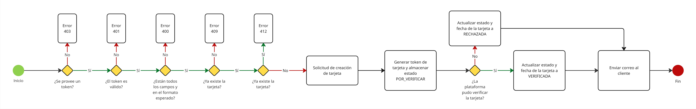
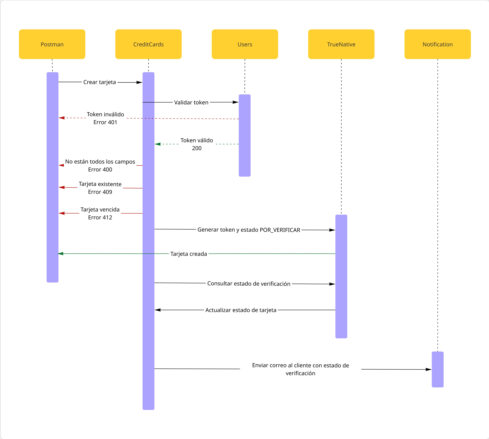

### Requerimiento RF-007

<table>
  <tr>
    <th>Requerimiento</th>
    <th>RF007</th>
  </tr>
  <tr>
    <td>Patrón utilizado</td>
    <td>Request callback pattern</td>
  </tr>
  <tr>
    <td>Justificación</td>
    <td>Con este patrón se informa el resultado de la operación a través de un webhook para realizar las actualizaciones respectivas en BD y permitir a los usuarios usar la aplicación.</td>
  </tr>
  <tr>
    <td>Componentes involucrados</td>
    <td>
      <ul>
        <li>Microservicio usuarios</li>
        <li>TrueNative</li>
      </ul>
    </td>
  </tr>
</table>

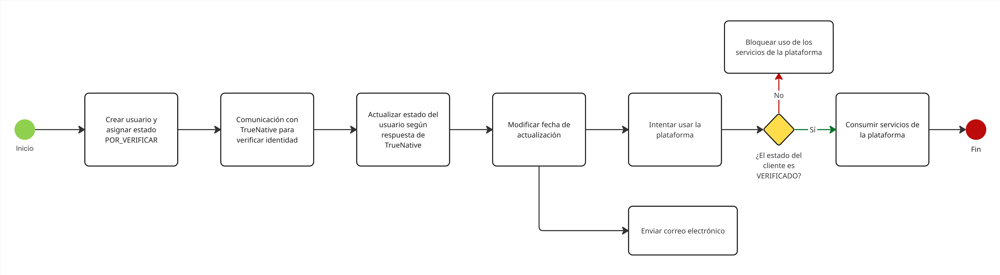
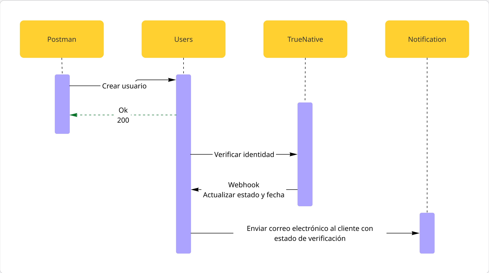
